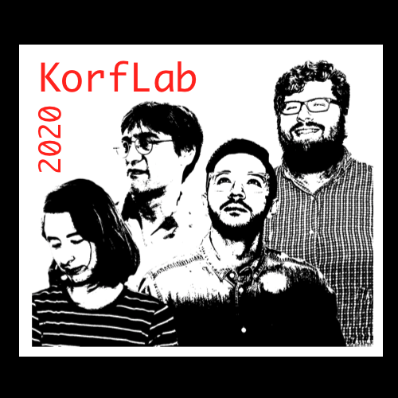
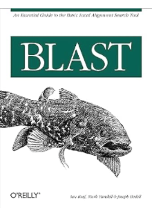
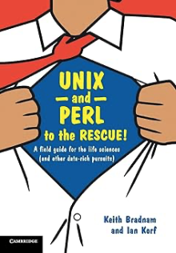

Welcome to the home page of Ian Korf's research group at UC Davis. Our lab uses
computational methods to study problems in molecular biology. More
specifically, we are interested in the mappings from structure to function. We
are particularly interested in discerning biological signal from biological
noise. Our favorite topics include alternative splicing, gene prediction,
intron function, gene expression, sequence alignment, protein-DNA interactions,
motif-finding, genome assembly, repeat analysis, and almost anything that mixes
genotype, phenotype, evolution, and algorithms. We love developing new methods
in emerging disciplines but also adore the classics.

## People ##

+ Ian Korf - PI
+ PhD students
	+ [Osman Sharifi]()
	+ [Viki Haghani](https://vhaghani26.github.io)
	+ [Ismael Acedo](https://icacedo.github.io)
	+ [Lilith Marinho-Davis]()
	+ [Kelly Chau](https://kellychau.github.io)
+ Undergraduates
	+ [Claire Hsieh](https://claire-hsieh.github.io)
	+ [Dellaraam Pourkeramati](https://dellaraam.github.io)
	+ [Kenta Hsu](https://kjhsu1.github.io)
	+ [Madison Sparks](https://madisonsparks.github.io)
	+ [Pearl Vishen]()
	+ [Riya Desai]()
	+ [Sarah Burton]()
	+ [Selene Han]()

Interested in joining the lab? Great, send me an email. I look for shared
interests and passion more than a specific skill set. You don't have to be a
good programmer to join the lab (but you will have to become one).

Clockwise from left: Hannah Lyman (vocals), Ian Korf (guitar), Keith Fraga
(bass), Osman Sharifi (drums). No, we are not actually a band but if I want my
lab to appear as if we have a shoegaze album, so be it.

## Publications ##

You can find a mostly up-to-date list of lab publications at my NIH Bibliography page:

[Bibliography](http://www.ncbi.nlm.nih.gov/myncbi/browse/collection/40794927/?sort=date&direction=ascending)

## Downloads ##

You can find some of our software and teaching materials at:

[KorfLab GitHub](https://github.com/KorfLab)

We have not yet moved all content to GitHub, but hope to one day. Some of our
highly accessed products are listed below.

+ [MCB185](https://github.com/iankorf/MCB185)
+ [Unix & Perl Primer for Biologists](https://github.com/KorfLab/unix_and_perl)
+ [StochHMM](https://github.com/KorfLab/StochHMM) HMM software
+ [SNAP](https://github.com/KorfLab/SNAP) gene prediction software
+ [IME](https://github.com/KorfLab/IME) intron mediated enhancement software

## Books ##

+ 
+ 
+ 

## Alumni ##

If you're a former member of the lab and your name doesn't appear on this list,
sorry for the omission. Please send me an email. I always like hearing from
former students.

Postdocs and Professional Researchers

+ Keith Bradnam
+ Genis Parra
+ Prashanth Ak
+ Peter Zeno
+ Kalyn Records
+ Ken Yu
+ Danielle Lemay
+ Chen Yu
+ Hannah Lyman

PhD Students

+ Kim Blahnik
+ Shahram Emami
+ Artem Zykovich
+ Daniel Melters
+ Paul Lott
+ Abigail Yu
+ Kristen Beck
+ Keith Dunaway
+ Stella Hartono
+ Christopher Beitel
+ Sam Westreich
+ Hannah Lyman
+ Keith Fraga

MS Students

+ Tali Elfersi
+ Yen Duong
+ Matthew Porter
+ Allen Kovach
+ Priyanka Kulkarni
+ Zhanghang Yan
+ Ravi Dandekar

Undergraduates

+ Yi Zhang
+ Alicia Winquist
+ Vince Ramey
+ Rajiv Pandey
+ Reza Garajehdaghi
+ Raymond Yu
+ Matt Wong
+ Jack Yu
+ Danny Li
+ Eric Kwok
+ Nathalie Telis
+ Ariana Cisneros
+ Alex Godbout
+ Roy Chu
+ Tiffany Ho
+ Arwin Lashawn
+ Xinming Xu
+ Ben Weller
+ Michelle Treiber
+ Joy Doong
+ Nick Weiner
+ Juan Marcucci
+ Laruen Kim Sing
+ Tiffany Hong
+ Alex Kramer
+ Lily Karim
+ Arwin Lashawn
+ Trevor Chan
+ Reese Carlson
+ Brandon Hom
+ Aryss Hearne
+ Nivedita Attada
+ Katherine Chiu
+ Tasha Mariano
+ Amalia Karesh
+ Aditi Goyal
+ Meghana Manepalli
+ Alan Zhang
+ Sreeram Sandrapati
+ Nikki Moreno
+ Sai Suresh
+ William Gardner
+ Jenna Noueihead

High School (YSP)

+ Tom Garret
+ Alex Han
+ Yale Chen
+ Adarsha Shivakumar
+ Michael Adler
+ Ben Edwards
+ Claire Shu
+ Jack Mao
+ Eric Perez
+ Richard Yu
+ David Wang
+ Veronica Lee
+ Allen Mao
+ Clara Wang
+ Gaby Berman
+ Joy Liu
+ Kaitlin Lim
+ Amber Henny
+ Daniel Zhu
+ Ella Yee
+ Aasiya Zaidi
+ Andrew Chu

High School (non-YSP)

+ Kelly Ostrum
+ Bryton Moeller

Other

+ Smaug

For some odd reason, Smaug (the dragon) used to be featured on our lab page.
He's gone now, but not forgotten.

